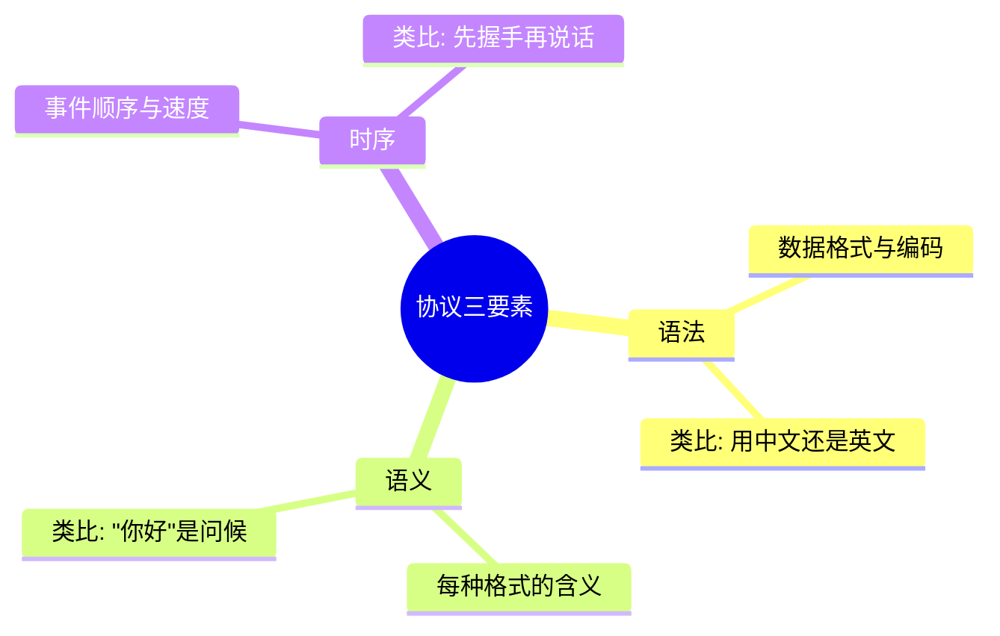
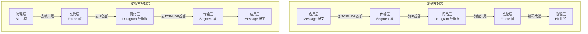
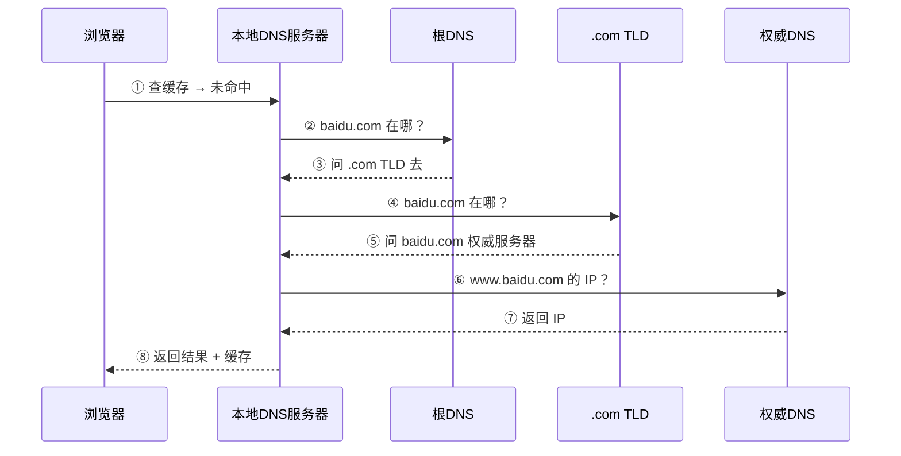
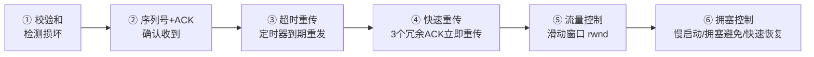
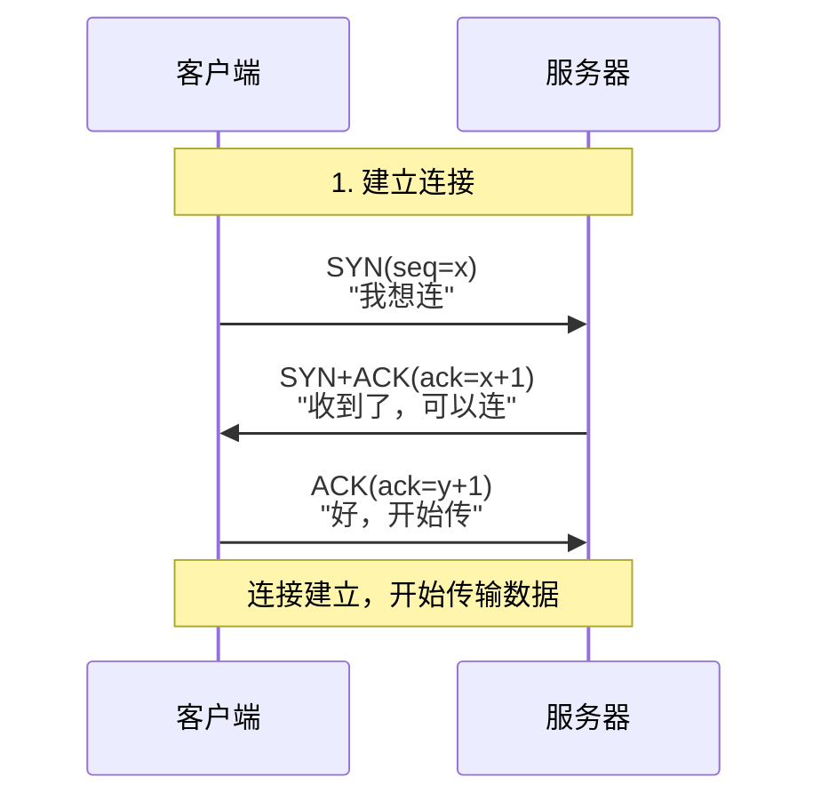
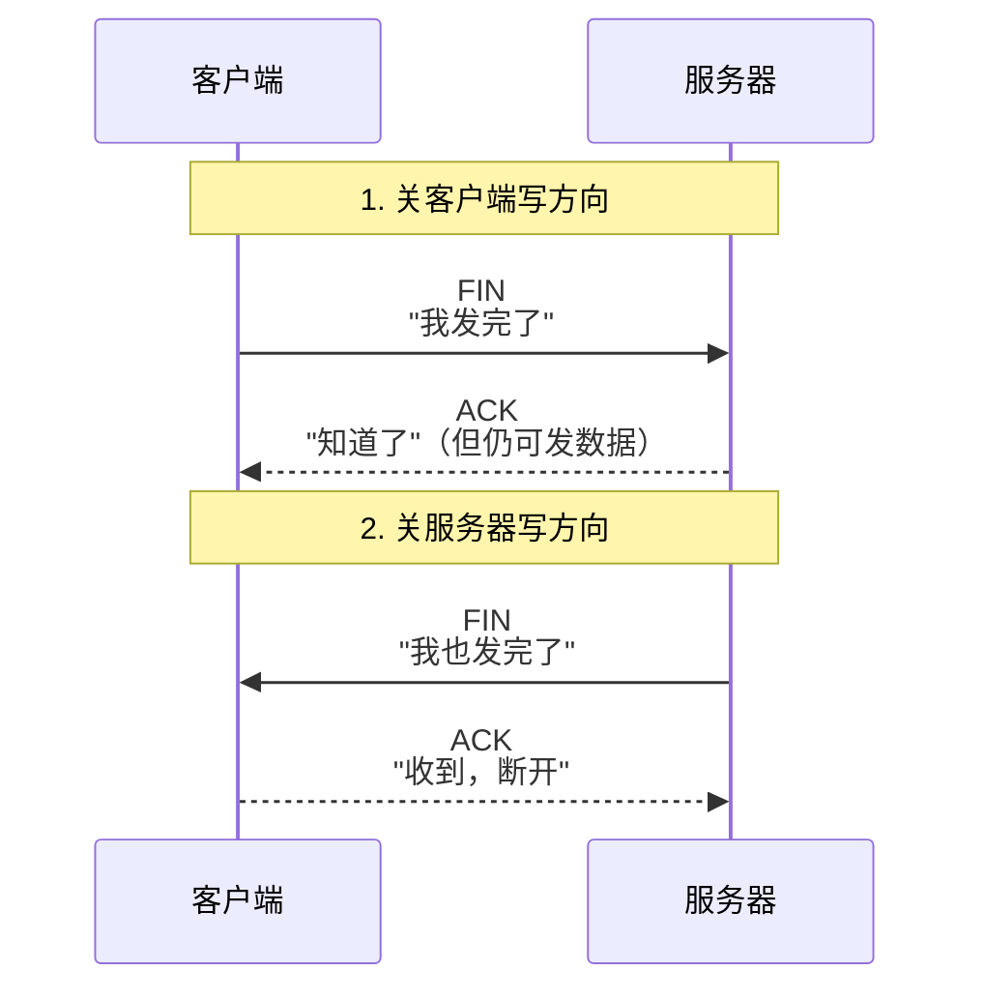
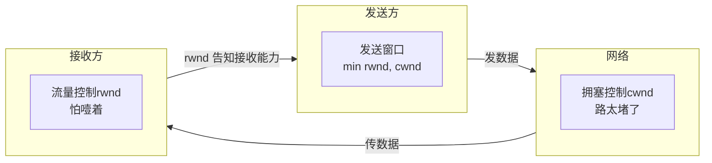
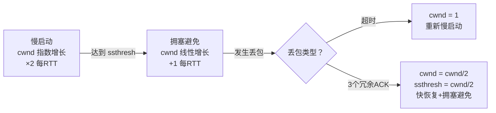
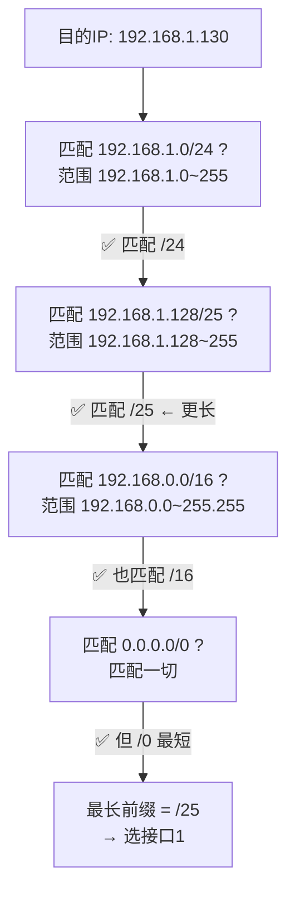
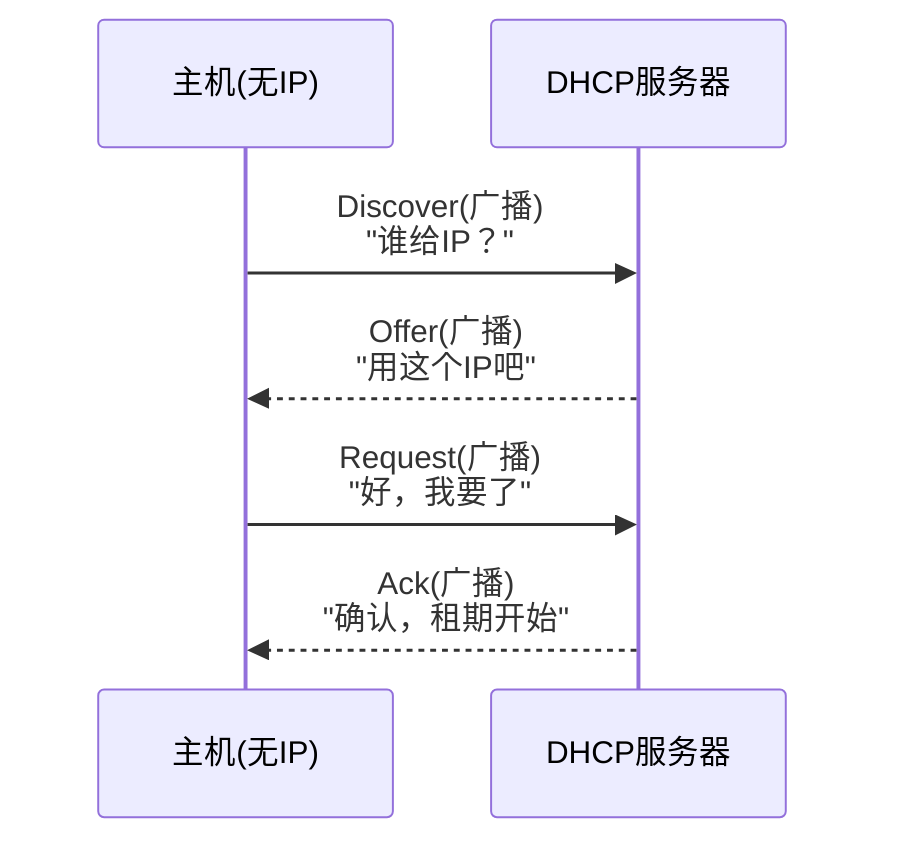

# 计算机网络 30 题速通笔记（12h 冲刺版）

> 等级：★★★★★ 必考 / ★★★★ 高频 / ★★★ 中频 / ★★ 低频
> 策略：先拿 ★★★★★，再扫 ★★★★，有余力看剩下的

---

## 一、基础概念

### 1. 什么是协议？★★★

**定义**：通信双方必须遵守的规则和约定。

**三要素**：



### 2. 互联网的理解 ★

| 角度 | 答案 |
|------|------|
| **组成角度** | 端系统（主机）+ 分组交换机（路由器/交换机）+ 通信链路，通过 ISP 层级互联 |
| **服务角度** | 为应用提供通信服务的基础设施，API 表现为 Socket 接口 |

### 3. 分组交换 vs 电路交换 ★★★★

| 特性 | 电路交换 | 分组交换 |
|------|---------|---------|
| 资源分配 | 预先独占 | 按需共享（统计复用） |
| 建连 | 需要（如电话） | 不需要 |
| 效率 | 低（静默期浪费） | 高 |
| 时延 | 固定 | 可变（排队时延） |
| 典型应用 | 传统电话网 | Internet |

> **时延公式**：总时延 = 处理时延 + 排队时延 + 传输时延 + 传播时延
> - 传输时延 = 分组长度 / 链路带宽（"推"到链路上）
> - 传播时延 = 距离 / 信号速度（在光纤上"跑"）

### 4. 为什么分层？★★★

① 模块化降复杂度  ② 各层独立演化  ③ 标准化接口  ④ 下层为上层复用

### 5. TCP/IP 五层模型 ★★★★★

```
应用层  — 为用户提供网络服务  — HTTP/DNS/SMTP  — 报文(Message)
传输层  — 进程间通信           — TCP/UDP        — 段(Segment)
网络层  — 主机间路由转发       — IP/ICMP/ARP    — 数据报(Datagram)
链路层  — 相邻节点帧传输       — Ethernet/WiFi  — 帧(Frame)
物理层  — 比特传输             — 光纤/双绞线    — 比特(Bit)
```

**数据单元变化流程**：



> 每层只处理自己的首部，payload 对下层透明。**发送加头，接收删头**。

---

## 二、应用层

### 7. HTTP vs HTTPS ★★★★★

| | HTTP | HTTPS |
|--|------|-------|
| 加密 | 明文 | TLS/SSL 加密 |
| 端口 | 80 | 443 |
| 证书 | 不需要 | 需要 CA 证书 |
| 安全性 | 无 | 机密性+完整性+身份认证 |

> HTTPS = HTTP + TLS

### 8. HTTP 为什么无状态？★★★★★

**设计取舍**：服务器不保留客户端历史请求。
- 优点：服务器简单，易横向扩展
- 补丁：Cookie/Session 补状态

**HTTP 相关综合题模板：**

| 对比维度 | 答案模板 |
|---------|---------|
| **GET vs POST** | GET 参数在 URL（可见），有长度限制，可缓存/书签；POST 参数在 body（不可见），无长度限制，不缓存 |
| **非持久 vs 持久连接** | 非持久：每个对象一个TCP连接，慢；持久：同一个TCP传多个对象（HTTP/1.1默认），快 |
| **Cookie 流程** | 服务器发 Set-Cookie → 浏览器存 → 下次请求带 Cookie → 服务器识别用户 |

### 9. DNS 过程和分步（简答模板）★★★★

**作用**：域名 → IP



**简答答题模板（直接背）：**
```text
用户主机向本地DNS服务器发起递归查询。
本地DNS服务器依次向根DNS、.com TLD、权威DNS发起迭代查询，
最终获得域名对应的IP地址，返回给用户主机并缓存结果。
```
> 注意：主机→本地DNS是**递归**，本地DNS→根/TLD/权威是**迭代**。

### 10. FTP 为什么双连接？★★

- **控制连接（21）**：传命令，整个会话保持
- **数据连接（20/随机）**：传文件，用完即关
- **理由**：带外控制，控制与数据分离

### 11. C/S vs P2P vs CDN ★

| 架构 | 解决问题 | 例子 |
|------|---------|------|
| C/S | 集中管理，一致性好 | Web, Email |
| P2P | 可扩展性（节点越多越快） | BitTorrent |
| CDN | 降低延迟（推到用户近处） | 视频网站 |

### 12. Socket 是什么？★★

> **Socket = IP 地址 + 端口号**

应用层与传输层之间的**抽象编程接口**。进程通过 Socket 收发数据。

---

## 三、传输层

### 13. TCP vs UDP ★★★★★

| 特性 | TCP | UDP |
|------|-----|-----|
| 连接 | 面向连接（三次握手） | 无连接 |
| 可靠 | 确认+重传 | 不可靠 |
| 有序 | 保证 | 不保证 |
| 速度 | 较慢 | 快 |
| 首部 | 20-60 字节 | 8 字节 |
| 流量/拥塞控制 | 有 | 无 |
| 应用 | Web/邮件/文件 | 直播/DNS/VoIP |

### 14. UDP 首部解析（大题实操）★★

**UDP首部固定 8 字节**：

```text
 0                   1                   2                   3
 0 1 2 3 4 5 6 7 8 9 0 1 2 3 4 5 6 7 8 9 0 1 2 3 4 5 6 7 8 9 0 1
+-+-+-+-+-+-+-+-+-+-+-+-+-+-+-+-+-+-+-+-+-+-+-+-+-+-+-+-+-+-+-+-+
|          源端口(16bit)         |         目的端口(16bit)         |
+-+-+-+-+-+-+-+-+-+-+-+-+-+-+-+-+-+-+-+-+-+-+-+-+-+-+-+-+-+-+-+-+
|           长度(16bit)          |          校验和(16bit)          |
+-+-+-+-+-+-+-+-+-+-+-+-+-+-+-+-+-+-+-+-+-+-+-+-+-+-+-+-+-+-+-+-+
```

**考试题示例：**
> UDP 段十六进制：`04 89 00 35 00 1C E4 17`
> 源端口 = 0x0489 = 1161 | 目的端口 = 0x0035 = 53(DNS)
> 长度 = 0x001C = 28 | 数据长度 = 28 - 8 = **20 字节**
> 校验和 = 0xE417（一般不要求算校验和）

**易错点：** 长度字段 = 首部 8 字节 + 数据部分。**数据长度要减 8**。

### 15. TCP 可靠传输机制 ★★★★★



### 16. 三次握手（含seq/ack计算）★★★★★



> **为什么不是两次？** 防止失效 SYN 到达服务器导致资源浪费。三次握手确认客户端"活着"且连接有效。

**序列号计算 2 条铁律：**
```text
① ACK = 对方的 seq + 1（SYN 和 FIN 各占一个序号）
② 挥手时一样的规则：收到 FIN → ack = 对方 seq + 1
```

**考试题示例：**
> 客户端发 SYN(seq=100)，服务器回 SYN+ACK，问 ack 字段填多少？
> 答：ack = 100 + 1 = **101**
>
> 变体：服务器发 FIN(seq=500)，客户端回 ACK，问 ack = ?
> 答：ack = 500 + 1 = **501**（FIN 也要吃一个序号）

### 17. 四次挥手 ★★★★★



> **为什么四次？** 全双工，每一方单独关。ACK 和 FIN 不能合并因为中间还有数据要发。
> **记忆：先关写方向，再关读方向**

### 18. 流量控制 vs 拥塞控制 ★★★★★

| | 流量控制 | 拥塞控制 |
|--|---------|---------|
| 关注 | 接收方处理能力 | 网络承载能力 |
| 原因 | 接收缓冲区满 | 路由器/链路过载 |
| 窗口 | rwnd（接收窗口） | cwnd（拥塞窗口） |
| 发送窗口 | **min(rwnd, cwnd)** | |



### 19. 粘包/拆包 ★★

**原因**：TCP 是字节流协议，无消息边界。
- 粘包：小包合并
- 拆包：大包分段

**解决**：① 定长消息 ② 分隔符 ③ 头部长度字段

### 20. 拥塞控制 cwnd 曲线（大题最爱考）★★★★★

**核心三阶段：**



**考试答题模板：**

> 初始 cwnd=1，ssthresh 初值=8（题目会给）
> - **慢启动阶段**：cwnd=1→2→4→8，每RTT翻倍
> - **到达 ssthresh=8** → 切到拥塞避免
> - **拥塞避免阶段**：cwnd=9→10→11...，每RTT+1
> - **发生丢包**（第X轮，假设 cwnd=12）
>   - 超时 → cwnd=1，ssthresh=12/2=6
>   - 3个冗余ACK → cwnd=12/2=6（快恢复）

**速记口诀：慢翻倍 → 快+1 → 丢包砍半 → 超时归1**

---

### 21. GBN / SR 丢帧追踪（大题常考）★★★★

**一句话区别：**

| | GBN | SR |
|--|-----|----|
| 接收方丢乱序帧 | ❌丢弃 | ✅缓存 |
| 确认方式 | 累计ACK | 逐一独立ACK |
| 重传范围 | 丢帧起**全部**重传 | **只重传**丢失帧 |
| 计时器 | 1个 | 每帧1个 |

**考试例题：**
> 发送方发 0~4，帧 2 丢失，其余正常到达。

| 步骤 | GBN 行为 | SR 行为 |
|------|---------|--------|
| 收到0,1 | ACK0, ACK1 | ACK0, ACK1 |
| 收到3 | ❌丢弃3，重发ACK1 | ✅缓存3，发ACK3 |
| 收到4 | ❌丢弃4，重发ACK1 | ✅缓存4，发ACK4 |
| 帧2超时 | 重传**2,3,4**全部 | **只重传帧2** |
| 收重传后 | 3,4也重新传来了 | 帧2到齐，交付[2,3,4] |

**易错点：** SR收到乱序帧的ACK序号=收到的帧序号（不是期望的序号！）

---

## 四、网络层

### 22. 转发 vs 路由 ★★★

| | 转发(Forwarding) | 路由(Routing) |
|--|-----------------|---------------|
| 范围 | 路由器内部（局部） | 整个网络（全局） |
| 动作 | 查表+从端口发出 | 运行协议算路由表 |
| 时间 | 每包一次(ns级) | 周期性更新(s级) |

### 23. IP 为什么不可靠？★★★

**Best-effort**：尽最大努力交付，但不保证。
- 可能丢失、乱序、重复、延迟
- 不确认、不重传、不保序
- 设计哲学：**上层(TCP)负责可靠，下层(IP)保持简单**

### 24. IP地址、子网掩码、CIDR ★★★

- **IP 地址**：32位，标识网络接口
- **子网掩码**：区分网络号和主机号（如 255.255.255.0 → 前24位网络号）
- **CIDR**：a.b.c.d/x，x 为网络前缀长度。打破 A/B/C 类，支持路由聚合
- 可用主机数 = $2^{32-x} - 2$（减去全0网络地址和全1广播地址）

### 25. 路由表·最长前缀匹配（大题必考）★★★★★

**场景**：路由器收到一个数据包，查路由表——**多条都匹配，选最精确的那条**（前缀最长的）。

**三步法做题**：

```text
① 目的IP 分别与每条路由的子网掩码做 AND（或用 /x 判断范围）
② 结果落在路由的网络地址范围内 → 这条匹配
③ 多条匹配 → 选前缀 /x 数值最大的那条（最长 = 最精确）
```

**例题**：

路由表：
| 目的网络 | 下一跳/接口 |
|---------|-----------|
| 192.168.1.0/24 | 接口0 |
| 192.168.1.128/25 | 接口1 |
| 192.168.0.0/16 | 接口2 |
| 0.0.0.0/0 | 接口3 |

> 目的 IP = **192.168.1.130**，从哪个接口转发？



**答案：接口1（因为 /25 前缀最长，最精确）**。

> **默认路由 0.0.0.0/0**：前缀长度=0，匹配所有IP。是"保底选项"——其他都不匹配才用它。

**易错点：**
- 不是匹配第一条，是**匹配里选最长前缀**
- /x 的数字**越大越精确**：/25 > /24 > /16
- 如果没有任何匹配 → 丢弃包 + 发 ICMP 差错报文给发送方

---

### 26. DHCP 过程 (DORA) ★★★



### 27. NAT ★★★

**解决**：① IPv4地址短缺（一个公网IP供多设备共享） ② 安全（内网对外不可见）

**原理**：内网IP:端口 → 映射 → 公网IP:端口，维护转换表。

### 28. LS vs DV 路由算法 ★★

| | LS(链路状态) | DV(距离向量) |
|--|-------------|-------------|
| 信息 | 全网拓扑 | 仅邻居距离 |
| 算法 | Dijkstra | Bellman-Ford |
| 收敛 | 快（计算大） | 慢（可能无穷） |
| 典型 | OSPF | RIP |

### 29. RIP / OSPF / BGP ★★

| 协议 | 类型 | 算法 | 场景 |
|------|------|------|------|
| RIP | IGP(内部) | DV | 小型网络（跳数≤15） |
| OSPF | IGP(内部) | LS | 大型企业/ISP |
| BGP | EGP(外部) | 路径向量 | AS之间，策略驱动 |

**RIP 路由表更新三规则（大题模板）：**
```text
收到邻居发来的路由表，每条距离 +1，然后：
① 新网络 → 直接添加
② 距离更短 → 更新
③ 来自同一邻居 → 强制更新（不管距离怎么变）
```

**RIP vs OSPF 一句话：**
```text
RIP = 只告诉邻居"我离谁多远"（跳数，≤15）
OSPF = 告诉全网"我和谁连着"（带宽，无限制）
```

### 30. ARP ★★★

### 30. ARP ★★★

**作用**：已知 IP，解析同一局域网内的 MAC 地址。

**过程**：
1. 查 ARP 缓存
2. 未命中 → 广播"谁的 IP 是 x？MAC 是什么？"
3. 目标回复"我是，MAC 是 xx:xx:xx:xx:xx:xx"
4. 写入 ARP 缓存（有时限）

### 31. 交换机 vs 路由器 ★★★★

| | 交换机(Switch) | 路由器(Router) |
|--|---------------|---------------|
| 工作层 | 链路层(二层) | 网络层(三层) |
| 寻址 | MAC 地址 | IP 地址 |
| 功能 | 帧转发（同子网） | 路由+转发（跨子网） |
| 广播域 | 不隔离 | 隔离 |

---

## 速记口诀

| 口诀 | 展开 | 速记技巧 |
|------|------|---------|
| **应传网链物** | 应用→传输→网络→链路→物理 | "应传往链物" |
| **上加下删** | 发送加头，接收删头 | 封装=加，解封=删 |
| **SYN→SYN+ACK→ACK** | 三次握手三消息 | 先说SYN，回带ACK |
| **FIN→ACK→FIN→ACK** | 四次挥手四消息 | 先关写→再关读 |
| **DORA** | Discover→Offer→Request→Ack | 多啦A梦的"多啦" |
| **校序确重流拥** | 校验+序列号+确认+重传+流量+拥塞 | TCP六大可靠机制 |
| **全网Dijkstra，邻居Bellman** | LS用Dijkstra，DV用Bellman-Ford | 路由算法二选一 |

---

> 考前一天建议：闭卷默写五层模型、三次挥手/四次握手流程、TCP/UDP 对比表。
> 剩下的靠读——读熟到看到关键词能想起一句话就行。
