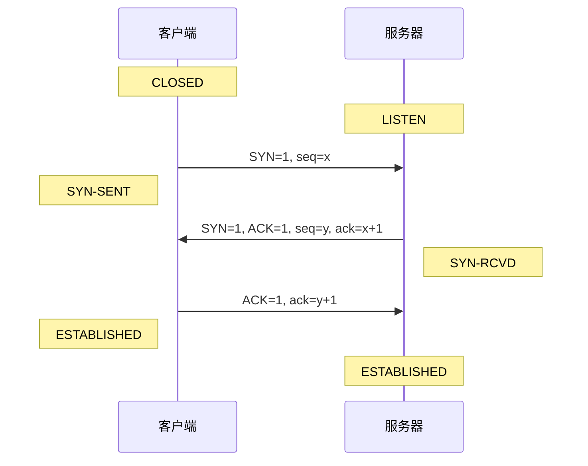
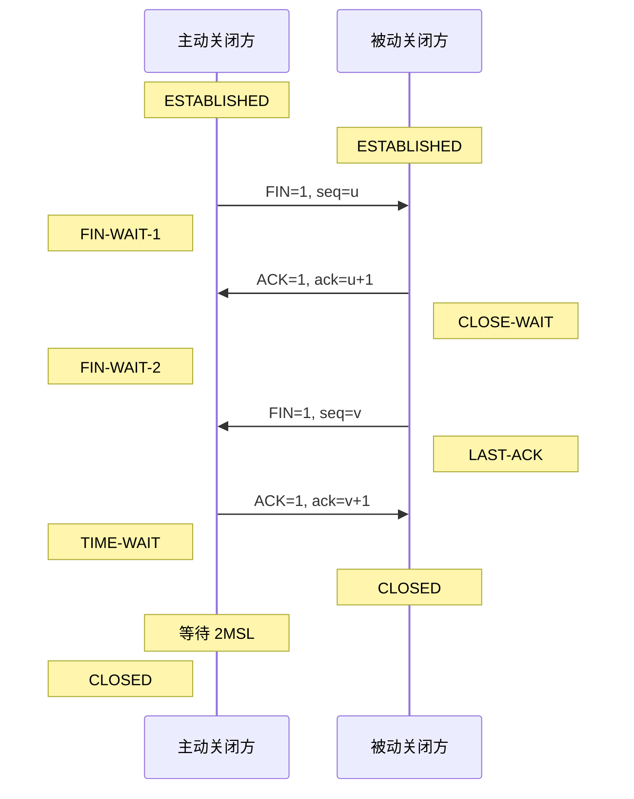
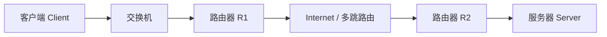

# 计算机网络专题强化：TCP连接、滑动窗口、拥塞控制、HTTP/HTTPS

> 现有资料里已有三次握手、四次挥手、HTTP/HTTPS、流量控制和拥塞控制的基础结论。  
> 本文件补强：状态图、网络拓扑过程分析、滑动窗口与拥塞控制计算点。

---

# 1. TCP 三次握手

## 1.1 过程

```text
客户端 CLOSED -> SYN-SENT
客户端发送：SYN=1, seq=x

服务器 LISTEN -> SYN-RECEIVED
服务器发送：SYN=1, ACK=1, seq=y, ack=x+1

客户端 ESTABLISHED
客户端发送：ACK=1, ack=y+1
  
服务器收到 ACK 后进入 ESTABLISHED
```

## 1.2 时序图（推荐，考试画这个）

时序图（也叫梯子图）把时间从上往下画，左右分别是客户端和服务器，箭头是报文。



### 读图法

```text
时间从上往下读。每个箭头是一次报文发送，触发状态变迁。

客户端侧（左）：CLOSED → SYN-SENT → ESTABLISHED
服务器侧（右）：LISTEN → SYN-RCVD → ESTABLISHED

箭头上的标记是报文内容。
括号/注释里的标记是当前状态。
```

### 状态变迁表（背这个）

| 当前状态 | 触发事件 | 下一状态 |
|:---|:---|:---|
| **CLOSED** | 客户端发送 SYN | **SYN-SENT** |
| **SYN-SENT** | 收到 SYN+ACK，发送 ACK | **ESTABLISHED** |
| **LISTEN** | 收到 SYN，发送 SYN+ACK | **SYN-RCVD** |
| **SYN-RCVD** | 收到 ACK | **ESTABLISHED** |

### 考试画法（三步出图）

```
1. 画两条竖线：左标"客户端"，右标"服务器"
2. 从上往下画三个箭头：
   ① 客户端→服务器：标 SYN
   ② 服务器→客户端：标 SYN+ACK
   ③ 客户端→服务器：标 ACK
3. 在竖线旁标注各端的状态变化
```

## 1.3 为什么不是两次握手？

两次握手无法确认客户端是否真的收到了服务器的确认。如果一个旧的 SYN 报文在网络中延迟后又到达服务器，服务器可能误以为客户端要建立新连接，从而浪费资源。

三次握手的作用：

```text
1. 确认客户端发送能力正常。
2. 确认服务器接收和发送能力正常。
3. 确认客户端接收能力正常。
4. 防止历史连接请求导致服务器误开连接。
```

---

# 2. TCP 四次挥手

## 2.1 过程

```text
1. 主动关闭方发送 FIN，进入 FIN-WAIT-1。
2. 被动关闭方收到 FIN，回复 ACK，进入 CLOSE-WAIT。
3. 主动关闭方收到 ACK，进入 FIN-WAIT-2。
4. 被动关闭方数据发送完后发送 FIN，进入 LAST-ACK。
5. 主动关闭方收到 FIN，回复 ACK，进入 TIME-WAIT。
6. 被动关闭方收到 ACK，进入 CLOSED。
7. 主动关闭方等待 2MSL 后进入 CLOSED。
```

## 2.2 时序图（推荐，考试画这个）



### 读图法

```text
步骤 1：主动方发送 FIN → 主动方进入 FIN-WAIT-1
步骤 2：被动方回复 ACK → 被动方进入 CLOSE-WAIT（等它上面应用关闭）
步骤 3：主动方收到 ACK → 主动方进入 FIN-WAIT-2
步骤 4：被动方发送 FIN → 被动方进入 LAST-ACK
步骤 5：主动方回复 ACK → 主动方进入 TIME-WAIT，被动方进入 CLOSED
步骤 6：主动方等 2MSL 后 → 进入 CLOSED
```

### 状态变迁表（背这个）

| 侧 | 当前状态 | 触发事件 | 下一状态 |
|:---|:---|:---|:---|
| 主动方 | **ESTABLISHED** | 发送 FIN | **FIN-WAIT-1** |
| 主动方 | **FIN-WAIT-1** | 收到 ACK | **FIN-WAIT-2** |
| 主动方 | **FIN-WAIT-2** | 收到 FIN，发送 ACK | **TIME-WAIT** |
| 主动方 | **TIME-WAIT** | 等待 2MSL | **CLOSED** |
| 被动方 | **ESTABLISHED** | 收到 FIN，发送 ACK | **CLOSE-WAIT** |
| 被动方 | **CLOSE-WAIT** | 应用关闭，发送 FIN | **LAST-ACK** |
| 被动方 | **LAST-ACK** | 收到 ACK | **CLOSED** |

### 考试画法（四步出图）

```
1. 画两条竖线：左标"主动关闭方"，右标"被动关闭方"
2. 从上往下画四个箭头：
   ① 主动方→被动方：FIN
   ② 被动方→主动方：ACK
   ③ 被动方→主动方：FIN  （等待一定时间后）
   ④ 主动方→被动方：ACK
3. 在竖线旁标注各端状态变化
4. 在主动方 TIME-WAIT 旁写"等待 2MSL"
```

## 2.3 为什么通常是四次？

TCP 是全双工通信，两个方向可以独立关闭。主动方发送 FIN 只表示“我不再发送数据”，但被动方可能还有数据要发送，所以被动方先回 ACK，等数据发完后再发送 FIN。因此通常需要四次。

## 2.4 TIME-WAIT 的作用

```text
1. 保证最后一个 ACK 能被对方收到。
2. 让网络中旧连接的残留报文自然消失，避免影响下一次连接。
```

## 2.5 状态图速记（考试用）

### 三次握手只有 3 个报文、4 个状态变迁

```text
客户端：CLOSED → SYN-SENT → ESTABLISHED
服务器：LISTEN → SYN-RCVD → ESTABLISHED
```

画图诀窍：先画两条竖线（客户端/服务器），再画三个箭头（→SYN, ←SYN+ACK, →ACK），最后在旁边标状态。

### 四次挥手有 4 个报文、7 个状态变迁

```text
主动方：ESTABLISHED → FIN-WAIT-1 → FIN-WAIT-2 → TIME-WAIT → CLOSED
被动方：ESTABLISHED → CLOSE-WAIT → LAST-ACK → CLOSED
```

画图诀窍：画四条箭头（FIN→, ←ACK, ←FIN, →ACK），主动方注意 TIME-WAIT 要多写"2MSL"。

### 一句话区分 11 个状态

| 过程 | 主要状态 | 口诀 |
|:---|:---|:---|
| 三次握手 | CLOSED, LISTEN, SYN-SENT, SYN-RCVD, ESTABLISHED | **关听发收通** |
| 四次挥手 | FIN-WAIT-1, FIN-WAIT-2, CLOSE-WAIT, LAST-ACK, TIME-WAIT | **等一等，关等待，等超时** |

---

# 3. 结合网络拓扑分析 TCP 建立和释放

## 3.1 典型拓扑



## 3.2 建立连接时各层做什么

以客户端访问 Web 服务器为例：

```text
应用层：浏览器准备发起 HTTP/HTTPS 请求。
传输层：TCP 先进行三次握手，建立可靠连接。
网络层：IP 根据目的 IP 进行路由转发。
数据链路层：每一跳重新封装帧，源/目的 MAC 会随链路变化。
物理层：把比特转换为电/光/无线信号传输。
```

## 3.3 三次握手在拓扑中的流动

```text
1. Client -> Server：SYN
   路径：Client -> 交换机 -> R1 -> Internet -> R2 -> Server

2. Server -> Client：SYN+ACK
   路径：Server -> R2 -> Internet -> R1 -> 交换机 -> Client

3. Client -> Server：ACK
   路径：Client -> 交换机 -> R1 -> Internet -> R2 -> Server
```

注意：

```text
TCP连接的端点是客户端进程和服务器进程。
中间交换机、路由器只负责转发，不维护这个TCP连接的应用状态。
```

## 3.4 释放连接在拓扑中的流动

```text
1. Client -> Server：FIN
2. Server -> Client：ACK
3. Server -> Client：FIN
4. Client -> Server：ACK
```

答题模板：

```text
TCP连接建立和释放发生在传输层，由通信双方端系统完成。中间网络设备只根据MAC地址或IP地址逐跳转发报文，不参与TCP状态维护。建立连接使用三次握手，释放连接通常使用四次挥手。三次握手保证双方收发能力正常，四次挥手是因为TCP全双工通信两个方向需要分别关闭。
```

---

# 4. 滑动窗口与流量控制

## 4.1 滑动窗口是什么

滑动窗口允许发送方连续发送多个报文段，而不必每发一个就等待一个 ACK。窗口大小表示当前最多允许有多少未确认数据在网络中。

## 4.2 流量控制

流量控制是为了防止发送方发送太快，撑爆接收方缓存。

关键变量：

```text
rwnd = receiver window = 接收窗口
```

接收方通过 TCP 首部中的窗口字段告诉发送方：

```text
我还能接收多少字节。
```

## 4.3 发送窗口计算

发送方真正能发送多少，不只看接收方，还要看网络拥塞程度：

```text
发送窗口 = min(rwnd, cwnd)
```

其中：

```text
rwnd：接收方窗口，用于流量控制。
cwnd：拥塞窗口，用于拥塞控制。
```

## 4.4 核心计算题

### 题型1：求可发送数据量

题目：

```text
rwnd = 8000B，cwnd = 5000B，已发送未确认数据 = 2000B。
问还能继续发送多少字节？
```

答案：

```text
发送窗口 = min(8000, 5000) = 5000B
还能发送 = 5000 - 2000 = 3000B
```

### 题型2：窗口滑动

题目：

```text
发送窗口大小为5000B，已发送0~4999字节。
收到ACK=3000，表示3000之前的字节均已收到。窗口如何变化？
```

答案：

```text
ACK=3000 表示下一个期望字节是3000。
因此0~2999字节已确认，窗口左边界滑到3000。
若窗口大小仍为5000B，新的可发送范围为3000~7999。
```

---

# 5. 拥塞控制：慢开始、拥塞避免、快重传、快恢复

## 5.1 拥塞控制看什么

拥塞控制保护的是网络，防止网络中注入过多数据导致路由器缓存溢出、丢包和时延上升。

关键变量：

```text
cwnd：拥塞窗口
ssthresh：慢开始门限
```

## 5.2 慢开始

慢开始不是增长慢，而是从小窗口开始探测网络。

规律：

```text
每经过一个RTT，cwnd约翻倍。
1 -> 2 -> 4 -> 8 -> 16 ...
```

直到：

```text
cwnd >= ssthresh
```

然后进入拥塞避免。

## 5.3 拥塞避免

拥塞避免阶段线性增长：

```text
每经过一个RTT，cwnd约增加1 MSS。
```

例如：

```text
16 -> 17 -> 18 -> 19 ...
```

## 5.4 超时丢包

发生超时，说明网络拥塞比较严重。

常见处理：

```text
ssthresh = 当前cwnd / 2
cwnd = 1 MSS
重新进入慢开始
```

## 5.5 三个重复ACK

收到3个重复ACK，说明可能只是个别报文段丢失，网络没那么糟。

常见处理：

```text
执行快重传。
ssthresh = 当前cwnd / 2
cwnd = ssthresh
进入快恢复/拥塞避免附近
```

有些教材写法会把 cwnd 设为 ssthresh + 3 MSS；考试如果没有明确算法，按老师课件为准。

## 5.6 Tahoe vs Reno：两种拥塞控制版本

考试如果问"TCP Tahoe 和 TCP Reno 的区别"，核心答这一句：

| | Tahoe (1988) | Reno (1990) |
|---|---|---|
| 超时 | cwnd=1，重新慢启动 | cwnd=1，重新慢启动（同Tahoe） |
| 3个重复ACK | cwnd=1，重新慢启动 | cwnd减半，进入**快速恢复** |

**直觉：** Tahoe 一棍子打死——不管超时还是重复 ACK，全部砍到 1 重来。Reno 区分对待——超时说明网络可能真挂了（砍到 1），但 3 个重复 ACK 只说明丢了**一个**包（后面的包还在到达），所以只砍一半。

## 5.7 快速恢复的完整流程（Reno）

```
1. 收到 3 个重复 ACK
   → ssthresh = cwnd / 2
   → 立即重传丢失的包（不等超时！这就是"快速重传"）

2. cwnd = ssthresh + 3*MSS
   → 不是砍到 1，也不是砍到 ssthresh
   → +3 是因为已经收到了 3 个重复 ACK（意味着 3 个包已离开网络）

3. 之后每收到一个重复 ACK
   → cwnd += 1 MSS（暂时膨胀，允许继续发新包）

4. 新数据 ACK 到达
   → cwnd = ssthresh
   → 回到拥塞避免阶段
```

**状态机图（考试画这个）：**

```
              超时
          cwnd=1 ┌──────────────────────┐
          ssthresh=cwnd/2               │
                 │                      │
                 ▼                      │
           ┌──────────┐                 │
           │  慢启动   │ cwnd 翻倍       │
           └────┬─────┘                 │
                │ cwnd >= ssthresh      │
                ▼                       │
           ┌──────────┐   超时           │
           │ 拥塞避免  │────────────────┘
           └────┬─────┘
                │ 3个重复ACK
                ▼
           ┌──────────┐
           │ 快速恢复  │ ssthresh=cwnd/2, cwnd=ssthresh+3
           └────┬─────┘
                │ 新ACK到达
                ▼
            回到拥塞避免
```

## 5.8 为什么是"3"个重复 ACK？

因为 TCP 报文可能乱序到达。偶尔的乱序会产生 1~2 个重复 ACK，不代表丢包。

```
正常乱序：包3和包4到达顺序互换 → 最多 1~2 个重复 ACK
真的丢包：包4丢了，但包5、6、7 陆续到达 → 每个触发一个重复 ACK → 累积 3 个
```

3 是经验阈值：既能过滤掉乱序噪音，又不会等太久。

## 5.9 慢启动为什么叫"慢"？

1986 年 NSFNET 发生拥塞崩溃：吞吐量从 32Kbps 暴跌到不到 40bps。

在此之前，TCP 一上来就把整个接收窗口的数据全发出去。慢启动相比这个**全速起步**而言是"慢"的——第 1 个 RTT 只发 1 个包。但别被名字骗了：第 2 个 RTT 发 2 个，第 3 个发 4 个，实际上是指数起飞。

## 5.10 AIMD 为什么是公平的？

AIMD = Additive Increase（加性增大）+ Multiplicative Decrease（乘性减小）

关键洞察：**AIMD 被数学证明是唯一能让多个 TCP 流最终公平分享带宽的算法。**

直观解释：

```
两个流 A 和 B，带宽各占一部分：

加性增大（+1）：A 和 B 同步增长，差距不变
乘性减小（÷2）：占得多的被砍得更多（从 20 砍到 10，少 10；从 10 砍到 5，少 5）

多轮下来 → 两个流向公平点收敛
```

这就是经典的 TCP 锯齿图（cwnd 爬坡、被砍、再爬、再被砍）。

## 5.11 核心计算题

### 题型1：慢开始增长

题目：

```text
初始 cwnd=1 MSS，ssthresh=16 MSS。
问经过4个RTT后 cwnd是多少？
```

答案：

```text
RTT0：1
RTT1：2
RTT2：4
RTT3：8
RTT4：16
```

经过4个RTT后 cwnd=16 MSS，达到门限，之后进入拥塞避免。

### 题型2：拥塞避免增长

题目：

```text
cwnd=16 MSS，ssthresh=16 MSS。
进入拥塞避免后再经过3个RTT，cwnd是多少？
```

答案：

```text
拥塞避免每RTT增加1 MSS：
16 -> 17 -> 18 -> 19
```

所以 cwnd=19 MSS。

### 题型3：超时后的变化

题目：

```text
当前 cwnd=24 MSS 时发生超时，求新的 ssthresh 和 cwnd。
```

答案：

```text
ssthresh = 24 / 2 = 12 MSS
cwnd = 1 MSS
```

之后重新慢开始。

### 题型4：三个重复ACK后的变化

题目：

```text
当前 cwnd=20 MSS，收到3个重复ACK，求新的 ssthresh。
```

答案：

```text
ssthresh = 20 / 2 = 10 MSS
```

常规答法：

```text
执行快重传，进入快恢复或拥塞避免，cwnd调整到约ssthresh附近。
```

---

# 5.12 端口号、复用与分用

## 端口号

端口号是 16 位整数（0~65535），用来在传输层区分不同应用进程。

| 类别 | 范围 | 说明 |
|------|------|------|
| 知名端口 | 0~1023 | 系统保留，如 HTTP=80, HTTPS=443, DNS=53, FTP=21, SMTP=25 |
| 注册端口 | 1024~49151 | 应用程序可注册使用 |
| 动态/私有端口 | 49152~65535 | 客户端临时使用 |

## 复用（Multiplexing）

发送端：多个应用进程的数据 → 加上不同端口号 → 复用为一个 IP 数据报发送。

```text
浏览器(端口 50001) ─┐
QQ(端口 50002)      ├── 传输层(TCP/UDP) ──→ 网络层(IP) ──→
游戏(端口 50003)    ─┘
```

## 分用（Demultiplexing）

接收端：IP 层交付给传输层 → 根据端口号分发到正确的应用进程。

```text
网络层(IP) ──→ 传输层(TCP/UDP) ──┬──→ 端口 80 → Web服务器
                                  ├──→ 端口 25 → 邮件服务器
                                  └──→ 端口 53 → DNS服务器
```

> 考试常问："传输层的复用和分用是什么意思？"答：发送端将多个应用进程数据封装到同一传输层协议叫复用；接收端按端口号交付给对应进程叫分用。

# 5.13 TCP报文段首部格式

TCP 首部最小 20 字节，最大 60 字节（选项字段可变）。

```text
 0                   15 16                   31
├─────────────────────┼─────────────────────┤
│      源端口号        │      目的端口号       │
├─────────────────────┴─────────────────────┤
│                 序号(seq)                  │ ← 本报文段第一个字节的序号
├───────────────────────────────────────────┤
│                确认号(ack)                 │ ← 期望收到的下一个字节序号
├─────┬─────┬─┬─┬─┬─┬───┬─────────────────┤
│首部长度│保留 │U│A│P│R│S│F│   窗口大小       │
│ (4bit) │(6bit)│R│C│S│S│Y│I│   (16bit)       │
│       │     │G│K│H│T│N│N│                 │
├───────┴─────┴─┴─┴─┴─┴─┴─┴─────────────────┤
│            校验和 (16bit)                   │
├───────────────────────────────────────────┤
│           紧急指针 (16bit)                  │
├───────────────────────────────────────────┤
│              选项 (可变)                    │
└───────────────────────────────────────────┘
```

### 必背标志位（6个）

| 标志 | 含义 | 作用 |
|------|------|------|
| URG | 紧急指针有效 | 带外数据 |
| **ACK** | 确认号有效 | 握手中 SYN 之后所有报文都置 ACK=1 |
| PSH | 立即推送 | 接收方不缓存，直接交给应用 |
| RST | 复位连接 | 连接异常时强制断开 |
| **SYN** | 同步序号 | 建立连接时用（三次握手） |
| **FIN** | 发送方数据完毕 | 释放连接（四次挥手） |

### 关键字段

| 字段 | 大小 | 含义 | 考试重点 |
|------|------|------|---------|
| 源端口 | 16bit | 发送进程端口号 | 复用分用 |
| 目的端口 | 16bit | 接收进程端口号 | 复用分用 |
| **序号(seq)** | 32bit | 本报文段数据第一个字节的编号 | 三次握手 seq=x |
| **确认号(ack)** | 32bit | 期望收到的下一个字节序号 = 已收到最后一个字节+1 | 三次握手 ack=x+1 |
| 首部长度 | 4bit | 以 4 字节为单位，最小 5（20字节） | 计算题 |
| **窗口** | 16bit | 接收方还能接收的字节数（rwnd） | 流量控制 |
| 校验和 | 16bit | 差错检测 | 必算 |

> 考试注意：序号和确认号是相对字节流的偏移，不是包序号。发送 1~1000 字节 → 下一个 seq=1001。

# 5.14 TCP可靠传输的实现

TCP 通过 4 个机制实现可靠传输：

## 1. 序号与确认

```text
发送方：每个字节有编号
接收方：每收到数据就回 ACK，确认号 = 已连续收到的最后一个字节 + 1
```

## 2. 累计确认（Cumulative ACK）

```text
收到 ACK=n → 表示 n-1 及之前的所有字节都已收到
不是每个报文段单独确认，而是一直累计
```

例：发送 1~1000, 1001~2000, 2001~3000
- 收到 2001~3000 但 1001~2000 丢了
- ACK 仍是 1001（只确认到 1000）
- 即使后面的到了也不算

## 3. 超时重传

详见 §5.15。

## 4. 快速重传

收到 3 个重复 ACK 不等超时，立即重传缺失的报文段。

### 乱序处理

TCP 接收方缓存乱序到达的报文段，等缺失的段到达后一起按序交付给应用层。

> 一句话：编号 → 确认 → 累计确认 → 超时/快速重传 → 乱序缓存 → 按序交付。

# 5.15 TCP超时重传时间的选择

超时时间（RTO）太短 → 过早重传浪费带宽；太长 → 响应慢。

## 公式

```text
EstimatedRTT = (1 - α) × EstimatedRTT + α × SampleRTT
通常 α = 0.125

DevRTT = (1 - β) × DevRTT + β × |SampleRTT - EstimatedRTT|
通常 β = 0.25

TimeoutInterval = EstimatedRTT + 4 × DevRTT
```

## 直觉

```text
EstimatedRTT  = RTT 的加权平均值（平滑掉波动）
DevRTT        = RTT 的波动幅度（偏离均值的程度）
超时时间       = 平均值 + 4倍波动（给足安全余量）
```

## 计算例题

```text
已知 EstimatedRTT = 100ms, DevRTT = 20ms
问 TimeoutInterval = ?

答：100 + 4×20 = 180ms
```

> 考试一般不要求算加权公式，但要记住 **TimeoutInterval = EstimatedRTT + 4×DevRTT**。

# 5.16 TCP选择确认（SACK）

## 为什么需要 SACK

累计确认的缺陷：接收方只能说"我收到了前 1000 字节"，不能说"第 1500~2000 我已经有了，只缺 1001~1499"。

## SACK 做了什么

```text
没有 SACK：丢了一个段 → 发送方可能重传后面所有段
有 SACK：   接收方在 ACK 的选项字段告诉发送方：
           "我收到了 1~1000 和 1501~3000，只缺 1001~1500"
           → 发送方只重传 1001~1500
```

## SACK 的格式

TCP 选项字段中，SACK 用左右边界描述已收到的连续块：

```text
TCP选项：SACK 左边界=1501, 右边界=3000
含义：字节 1501~3000 已收到
```

## 考试问法

```text
"简述 TCP 选择确认（SACK）的作用"
→ SACK 允许接收方告知发送方哪些乱序到达的数据块已收到，
   发送方只需重传真正丢失的段，减少不必要的重传，提高效率。
```

---

# 6. HTTP 与 HTTPS 区别

## 6.1 对比表

| 对比点 | HTTP | HTTPS |
|---|---|---|
| 全称 | HyperText Transfer Protocol | HTTP over TLS/SSL |
| 默认端口 | 80 | 443 |
| 安全性 | 明文传输，不安全 | 加密传输 |
| 身份认证 | 无证书认证 | 使用CA证书认证服务器身份 |
| 完整性 | 不保证传输内容不被篡改 | 可检测篡改 |
| 性能 | 开销较小 | 多TLS握手和加解密开销 |
| 典型用途 | 普通网页 | 登录、支付、隐私数据 |

## 6.2 简答模板

HTTP 是应用层协议，采用明文传输，默认端口为80，本身不提供加密、身份认证和完整性保护。HTTPS 是在 HTTP 基础上加入 TLS/SSL 安全层，默认端口为443，可以提供数据加密、服务器身份认证和完整性保护，因此比 HTTP 更安全，但会带来证书管理和加解密开销。

## 6.3 浏览器访问 HTTPS 网站全过程

```text
1. DNS解析域名，得到服务器IP。
2. TCP三次握手，建立TCP连接。
3. TLS握手，协商加密算法，验证服务器证书，生成会话密钥。
4. 浏览器发送加密后的HTTP请求。
5. 服务器返回加密后的HTTP响应。
6. 通信结束后，TCP四次挥手释放连接。
```

## 6.4 HTTP 与 TCP 的关系

```text
HTTP 是应用层协议，规定请求和响应报文格式。
TCP 是传输层协议，负责可靠、有序、面向连接的字节流传输。
HTTP 通常基于 TCP，但 HTTP 的报文边界由 HTTP 自己定义，不由 TCP 定义。
```

---

# 7. 一页速背

```text
三次握手：SYN -> SYN+ACK -> ACK
目的：确认双方收发能力，防止历史连接。

四次挥手：FIN -> ACK -> FIN -> ACK
原因：TCP全双工，两个方向分别关闭。

TIME-WAIT：保证最后ACK到达；让旧报文消失。

发送窗口 = min(rwnd, cwnd)
rwnd保护接收方，cwnd保护网络。

慢开始：cwnd指数增长，1、2、4、8...
拥塞避免：cwnd线性增长，每RTT加1。
超时：ssthresh=cwnd/2，cwnd=1。
三个重复ACK：快重传，ssthresh=cwnd/2。

复用：多个进程→一个传输层发送。
分用：传输层按端口号→交给对应进程。
端口：16bit，0~65535。知名端口0~1023。

TCP首部：源端口、目的端口、序号、确认号、首部长度、窗口、SYN/ACK/FIN。
确认号 = 期望收到的下一个字节序号 = 已收到最后一个+1。

可靠传输：序号+确认+累计确认+超时重传+快速重传+SACK。
超时重传时间：TimeoutInterval = EstimatedRTT + 4×DevRTT。
SACK：接收方告诉发送方哪些乱序块已收到，只重传真正丢失的段。

HTTP：明文，80，无状态。
HTTPS：HTTP+TLS，443，加密、认证、完整性。
```

