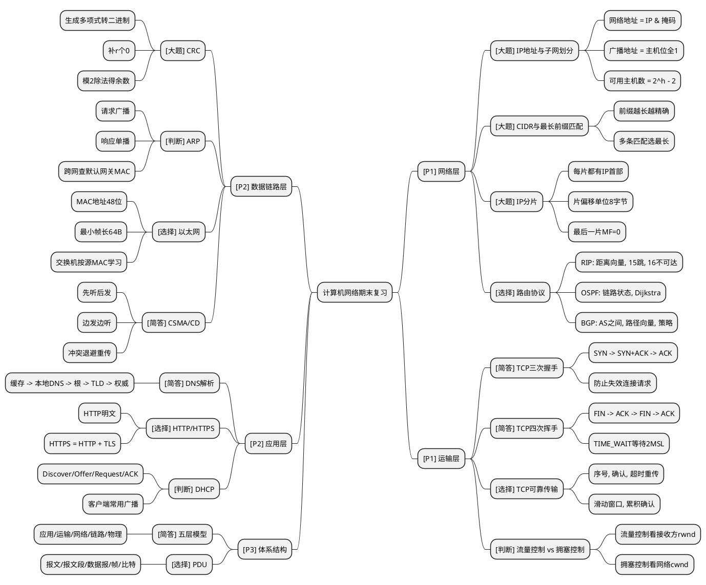
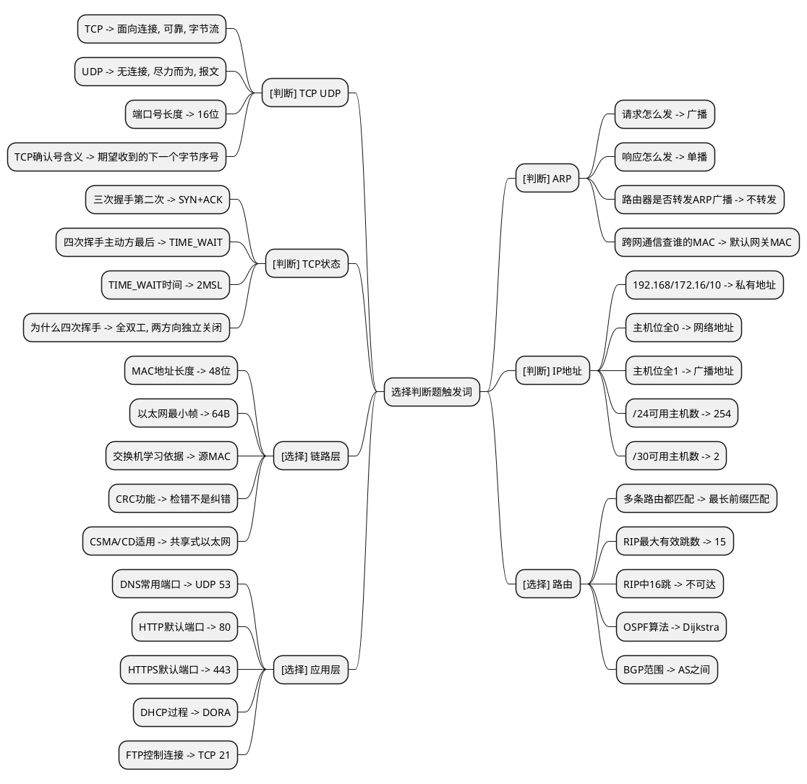
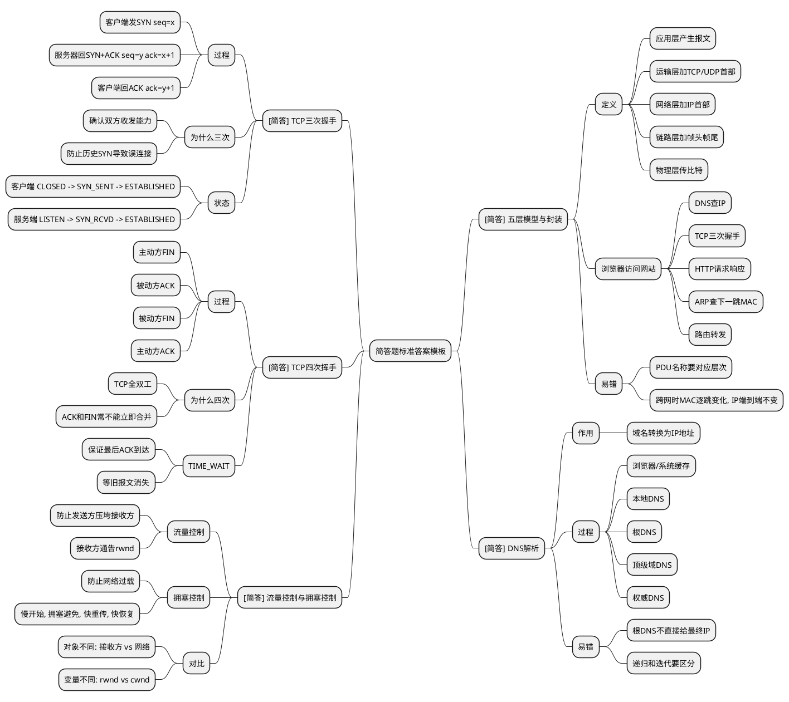
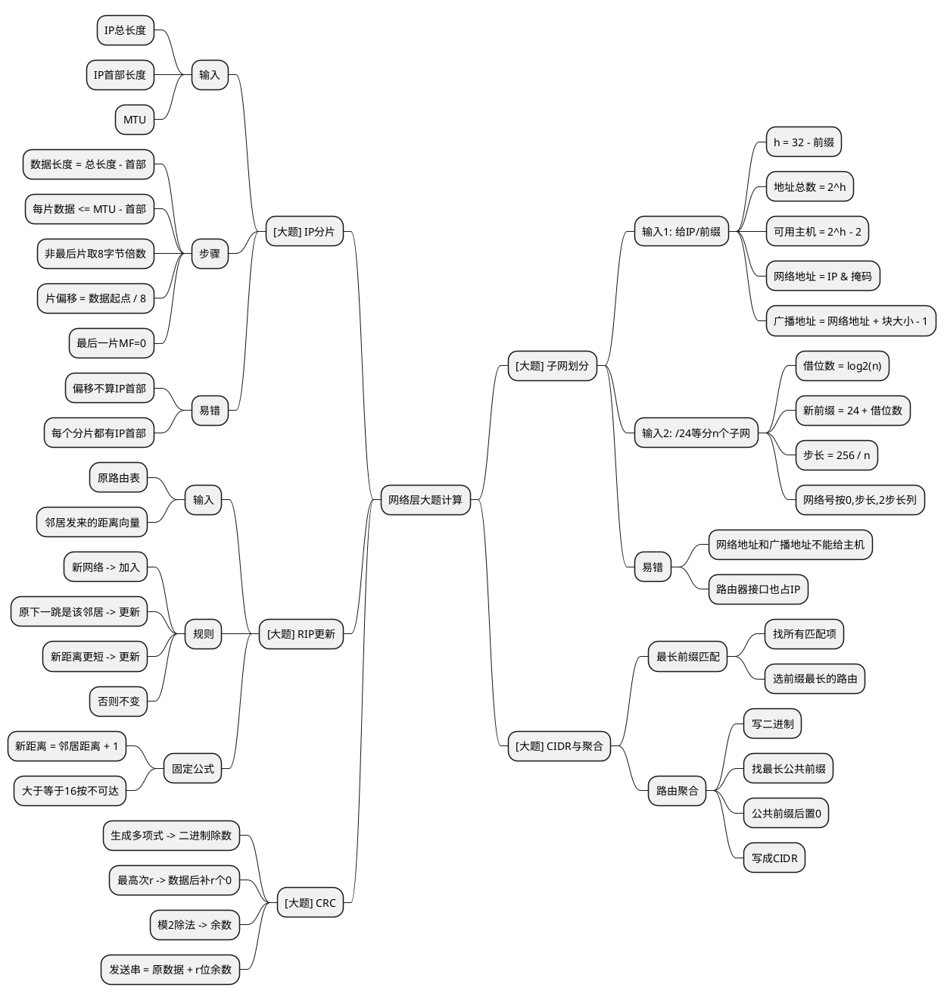
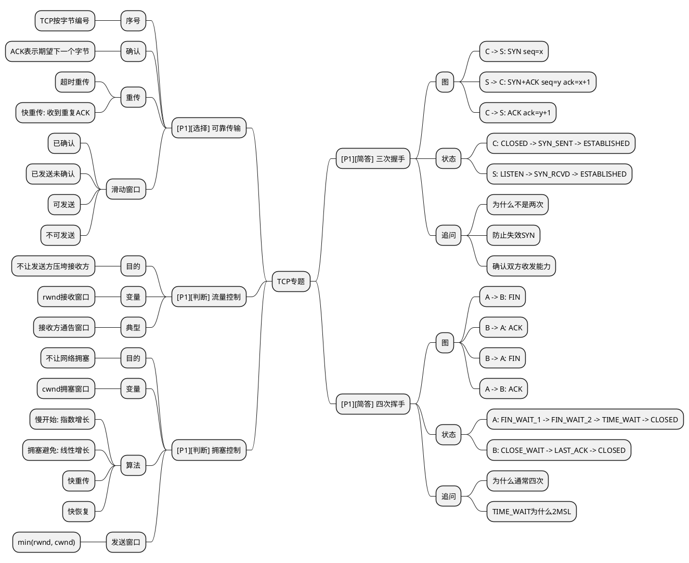
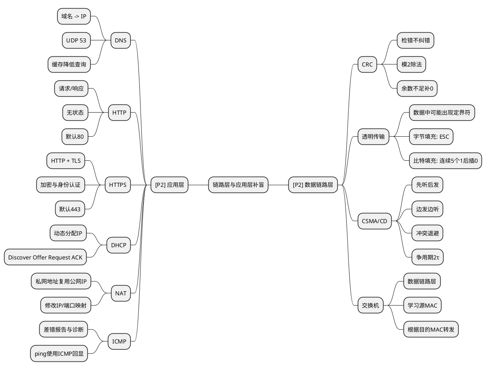

# 计算机网络高质量思维导图

> 用法：不要从头到尾“看图”。每张图都按“题目触发词 -> 标准答案”背。  
> 目标：解决选择题、判断题、简答题答不出来的问题；大题另用计算模板图训练。

---

## 0. 先看哪张

| 时间 | 看法 | 目标 |
|---|---|---|
| 10分钟 | 看 `00 总览` | 知道每层考什么 |
| 25分钟 | 看 `01 选择判断触发词` | 处理客观题陷阱 |
| 35分钟 | 看 `02 简答题模板` | 能写出过程类答案 |
| 45分钟 | 看 `03 网络层计算` | 子网、分片、路由表能算 |
| 35分钟 | 看 `04 TCP专题` | 三次握手、四次挥手、可靠传输能画能解释 |

---

## 1. 00 总览图：按分值优先级记忆

---

## 2. 01 选择判断触发词图

背法：遮住箭头右边，只看触发词，强迫自己说答案。

---

## 3. 02 简答题模板图

背法：每个二级节点都按“定义一句话 + 过程/原因 + 易错点”写。

---

## 4. 03 网络层计算图

背法：按输入类型选择分支。看到题目给什么，就走哪条路线。

---

## 5. 04 TCP专题图

背法：TCP一定要会“画图 + 解释为什么 + 对比机制”。

---

## 6. 05 链路层与应用层补盲图

---

## 7. 为什么这版比旧图好

| 旧图问题 | 新版处理 |
|---|---|
| 全课程塞进一张图，视觉密度过高 | 拆成 5 张任务图 |
| 节点多但不知道怎么考试 | 每个节点标注 `[选择]`、`[判断]`、`[简答]`、`[大题]` |
| 概念孤立，不能触发答案 | 改为“触发词 -> 标准答案/陷阱” |
| TCP、网络层大题被淹没 | 单独拆出 TCP 图、网络层计算图 |
| 背图时没有顺序 | 给出 10/25/35/45 分钟阅读路径 |

---

## 8. 参考的开源导图思路

- [markdown-viewer/skills - mindmap skill](https://github.com/markdown-viewer/skills/blob/main/mindmap/SKILL.md)：采用 PlantUML mindmap，更适合分左右侧、控制层级。
- [axtonliu/axton-obsidian-visual-skills](https://github.com/axtonliu/axton-obsidian-visual-skills)：适合后续升级成 Obsidian Canvas 或 Excalidraw 版。
- [0x-man/mindmap-skill](https://github.com/0x-man/mindmap-skill)：思路上强调来源、缺口和结构化布局。

