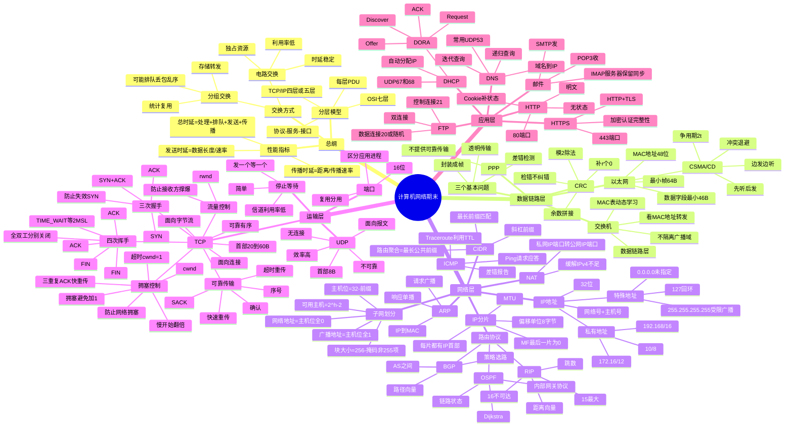
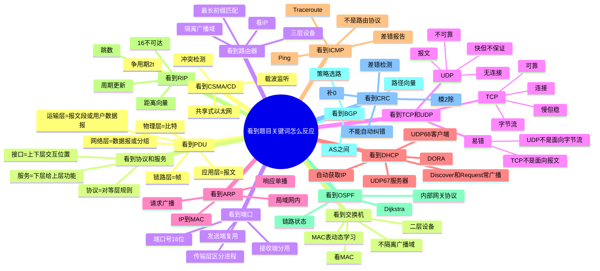
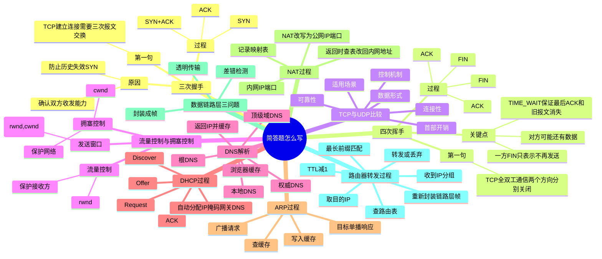
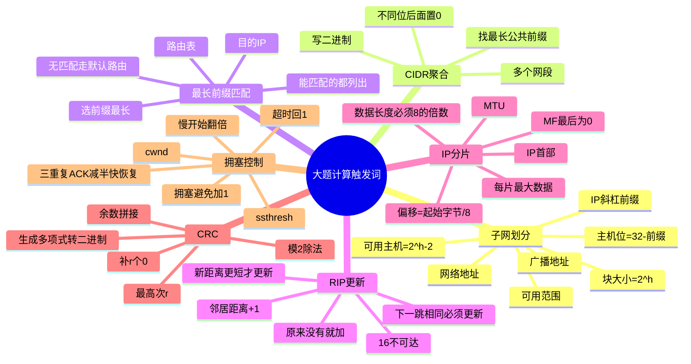
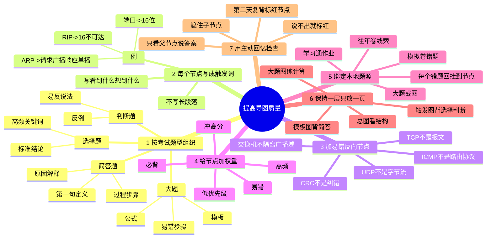

# 计算机网络：选择 / 判断 / 简答思维导图

> 用途：不是替代详细笔记，而是帮你在考场看到关键词时，快速想起“该选什么、判断什么、简答写哪几句”。  
> 使用方法：先看总图，再看“题型触发图”，最后用“导图质量提升图”检查自己有没有真正记住。

---

## 1. 总思维导图



---

## 2. 选择题 / 判断题触发图



---

## 3. 简答题答题模板图



---

## 4. 计算题与大题触发图



---

## 5. 哪些东西能提高这张思维导图的质量



---

## 6. 最小背诵版：看到这些词要秒反应

| 题目关键词 | 你要立刻想到 |
|---|---|
| PDU | 比特、帧、数据报/分组、报文段、报文 |
| 协议 | 对等层通信规则 |
| 服务 | 下层给上层提供功能 |
| 发送时延 | 数据长度 / 发送速率 |
| 传播时延 | 距离 / 传播速率 |
| CRC | 检错，不纠错，补0模2除 |
| CSMA/CD | 先听后发，冲突检测，2t |
| MAC | 48位，链路层地址 |
| 交换机 | 二层，MAC表动态学习，不隔离广播域 |
| 路由器 | 三层，按IP转发，隔离广播域 |
| ARP | IP到MAC，请求广播，响应单播 |
| DHCP | DORA，自动分配IP |
| ICMP | 差错报告，Ping，Traceroute |
| RIP | 距离向量，跳数，16不可达 |
| OSPF | 链路状态，Dijkstra |
| BGP | AS之间，路径向量，策略 |
| TCP | 连接、可靠、字节流 |
| UDP | 无连接、不可靠、报文 |
| 端口 | 16位，复用分用 |
| 流量控制 | rwnd，保护接收方 |
| 拥塞控制 | cwnd，保护网络 |
| HTTP | 80，明文，无状态 |
| HTTPS | 443，TLS，加密认证完整性 |
| DNS | 域名到IP |
| NAT | 私网IP端口到公网IP端口 |

---

## 7. 使用方法

```text
第一遍：只看第1张总图，建立层级框架。
第二遍：看第2张触发图，专门应对选择题和判断题。
第三遍：看第3张模板图，专门应对简答题。
第四遍：看第4张大题图，拿纸手算子网、RIP、分片、CRC。
最后：遮住右侧答案，只看第6节关键词，能不能秒答。
```

